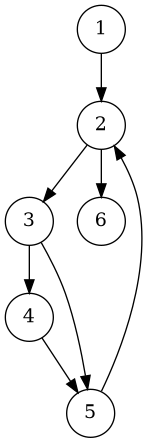

# Exercise 9 - Answers

## Given

- N = {1, 2, 3, 4, 5, 6}
- N0 = {1}, Nf = {6}
- E = {(1,2), (2,3), (2,6), (3,4), (3,5), (4,5), (5,2)}
- def(1) = def(3) = use(3) = use(6) = {x}
- The use of x in node 3 precedes the def of x in node 3.

Test Paths:
- t1 = [1, 2, 6]
- t2 = [1, 2, 3, 4, 5, 2, 3, 5, 2, 6]
- t3 = [1, 2, 3, 5, 2, 3, 4, 5, 2, 6]
- t4 = [1, 2, 3, 5, 2, 6]

---

## (a) Draw the graph

PlantUML source:

---

## (b) All du-paths with respect to x

Definitions of x: nodes 1 and 3.
Uses of x: nodes 3 and 6.
A du-path must be def-clear (no redefinition of x on interior nodes; defs are at nodes 1 and 3).

### From def(1) to use(3):

1. **[1, 2, 3]** - interior node {2}, no def of x. Valid.

### From def(1) to use(6):

2. **[1, 2, 6]** - interior node {2}, no def of x. Valid.

### From def(3) to use(3):

Since use precedes def at node 3, we look for paths from 3 back to 3 (def-clear on interior nodes).

3. **[3, 4, 5, 2, 3]** - interior nodes {4, 5, 2}, no def of x. Valid.
4. **[3, 5, 2, 3]** - interior nodes {5, 2}, no def of x. Valid.

### From def(3) to use(6):

5. **[3, 4, 5, 2, 6]** - interior nodes {4, 5, 2}, no def of x. Valid.
6. **[3, 5, 2, 6]** - interior nodes {5, 2}, no def of x. Valid.

### Summary of all du-paths:

| # | du-path | Def node | Use node |
|---|---------|----------|----------|
| 1 | [1, 2, 3] | 1 | 3 |
| 2 | [1, 2, 6] | 1 | 6 |
| 3 | [3, 4, 5, 2, 3] | 3 | 3 |
| 4 | [3, 5, 2, 3] | 3 | 3 |
| 5 | [3, 4, 5, 2, 6] | 3 | 6 |
| 6 | [3, 5, 2, 6] | 3 | 6 |

---

## (c) du-paths toured by each test path (direct and sidetrip)

### Analysis:

**t1 = [1, 2, 6]**
- [1, 2, 6]: Direct tour.

**t2 = [1, 2, 3, 4, 5, 2, 3, 5, 2, 6]**
- [1, 2, 3]: Direct tour (subpath at 1-2-3).
- [3, 4, 5, 2, 3]: Direct tour (subpath at first 3: 3-4-5-2-3).
- [3, 5, 2, 6]: Direct tour (subpath at second 3: 3-5-2-6).
- [3, 5, 2, 3]: Sidetrip tour from first 3: path goes [3, **4**, 5, 2, 3]. The detour through node 4 between nodes 3 and 5 does not contain a def of x.

**t3 = [1, 2, 3, 5, 2, 3, 4, 5, 2, 6]**
- [1, 2, 3]: Direct tour (subpath at 1-2-3).
- [3, 5, 2, 3]: Direct tour (subpath at first 3: 3-5-2-3).
- [3, 4, 5, 2, 6]: Direct tour (subpath at second 3: 3-4-5-2-6).
- [3, 5, 2, 6]: Sidetrip tour from second 3: path goes [3, **4**, 5, 2, 6]. The detour through node 4 between nodes 3 and 5 does not contain a def of x.

**t4 = [1, 2, 3, 5, 2, 6]**
- [1, 2, 3]: Direct tour (subpath at 1-2-3).
- [3, 5, 2, 6]: Direct tour (subpath at 3-5-2-6).

### Summary Table:

| Test Path | du-paths toured (Direct) | du-paths toured (Sidetrip only) |
|-----------|--------------------------|--------------------------------|
| t1 | [1, 2, 6] | -- |
| t2 | [1, 2, 3], [3, 4, 5, 2, 3], [3, 5, 2, 6] | [3, 5, 2, 3] |
| t3 | [1, 2, 3], [3, 5, 2, 3], [3, 4, 5, 2, 6] | [3, 5, 2, 6] |
| t4 | [1, 2, 3], [3, 5, 2, 6] | -- |

---

## (d) Minimal test set for All-Defs coverage (direct tours only)

All-Defs requires: for each definition of x, at least one du-path from that definition is toured.

- **def at node 1**: Need to tour at least one of [1,2,3] or [1,2,6].
- **def at node 3**: Need to tour at least one of [3,4,5,2,3], [3,5,2,3], [3,4,5,2,6], or [3,5,2,6].

**t4** directly tours [1, 2, 3] (covers def at 1) and [3, 5, 2, 6] (covers def at 3).

**Minimal test set: {t4}**

---

## (e) Minimal test set for All-Uses coverage (direct tours only)

All-Uses requires: for each def-use pair (d, u), at least one du-path from d to u is toured.

| Def-Use Pair | du-paths | Covered by (direct) |
|---|---|---|
| (def=1, use=3) | [1,2,3] | t2, t3, t4 |
| (def=1, use=6) | [1,2,6] | t1 |
| (def=3, use=3) | [3,4,5,2,3], [3,5,2,3] | t2, t3 |
| (def=3, use=6) | [3,4,5,2,6], [3,5,2,6] | t2, t3, t4 |

- Pair (def=1, use=6) requires **t1** (only test that directly tours [1,2,6]).
- Pair (def=3, use=3) requires **t2** or **t3**.
- The remaining pairs are then covered.

**Minimal test set: {t1, t2}** (or equivalently {t1, t3})

---

## (f) Minimal test set for All-du-paths coverage (direct tours only)

All-du-paths requires: every du-path must be directly toured.

| du-path | Directly toured by |
|---|---|
| [1, 2, 3] | t2, t3, t4 |
| [1, 2, 6] | **t1 only** |
| [3, 4, 5, 2, 3] | **t2 only** |
| [3, 5, 2, 3] | **t3 only** |
| [3, 4, 5, 2, 6] | **t3 only** |
| [3, 5, 2, 6] | t2, t4 |

- [1, 2, 6] requires **t1**.
- [3, 4, 5, 2, 3] requires **t2**.
- [3, 5, 2, 3] and [3, 4, 5, 2, 6] both require **t3**.
- All other du-paths are then covered by t1, t2, or t3.

**Minimal test set: {t1, t2, t3}**
