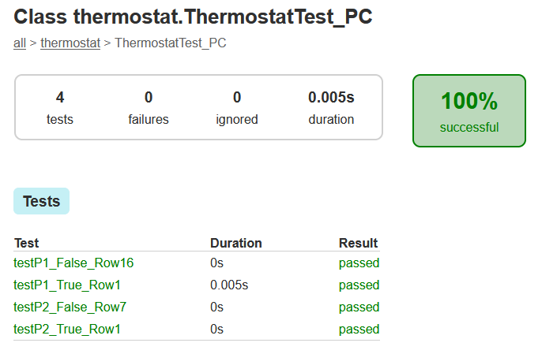
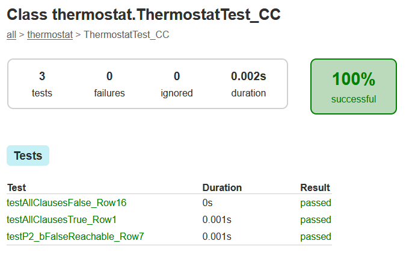
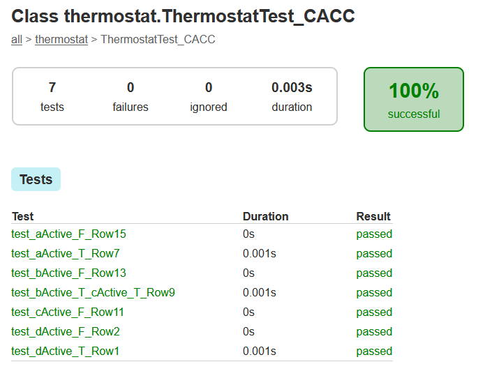
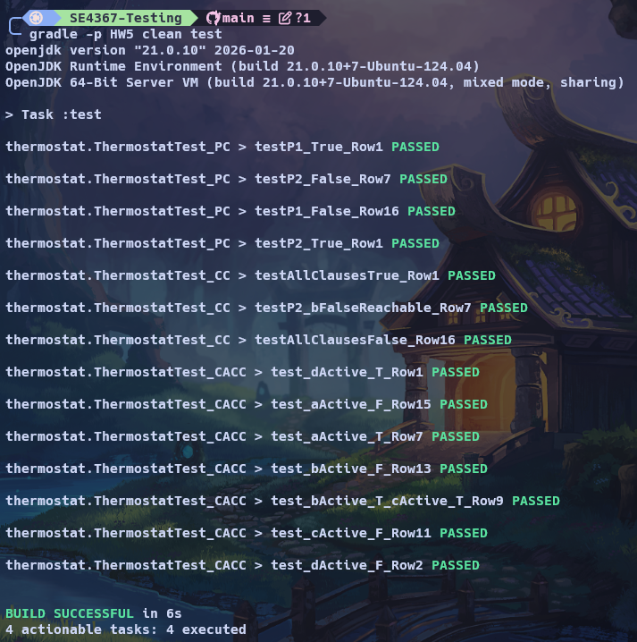

# SE 4367: Homework 5

Target method: `Thermostat.turnHeaterOn(ProgrammedSettings pSet)`.

```java
int dTemp = pSet.getSetting(period, day);

if (((curTemp < dTemp - thresholdDiff) ||           // a
     (override && curTemp < overTemp - thresholdDiff)) &&  // b && c
    (timeSinceLastRun > minLag))                    // d
{
    int timeNeeded = curTemp - dTemp;
    if (override)                                   // P2
        timeNeeded = curTemp - overTemp;
    setRunTime(timeNeeded);
    setHeaterOn(true);
    return true;
}
else { setHeaterOn(false); return false; }
```

---

## 1. Predicates (5 pts)

The method contains **two predicates**:

| # | Predicate | Expression | # Clauses |
|---|-----------|------------|-----------|
| P1 | outer `if` | `(a || (b && c)) && d` | **4** |
| P2 | inner `if` | `override` (= `b`) | **1** |

Where the atomic clauses are:

- `a = curTemp < dTemp - thresholdDiff`
- `b = override`
- `c = curTemp < overTemp - thresholdDiff`
- `d = timeSinceLastRun > minLag`

**Tally:** 1 predicate with 1 clause, 0 with 2 clauses, 0 with 3 clauses, and 1 predicate with more than 3 clauses (P1 has 4).

---

## Fixed inputs used by every test

To keep each row reproducible the tests share the same scaffolding:

| Setting | Value |
|---|---|
| `period` | `Period.DAY` |
| `day`    | `DayType.WEEKDAY` |
| `pSet.getSetting(DAY, WEEKDAY)` -> `dTemp` | `65` (default) |
| `thresholdDiff` | `5` |
| `minLag` | `10` |

Only `curTemp`, `override`, `overTemp`, and `timeSinceLastRun` vary per test.

---

## 2. Predicate Coverage (PC): 30 pts

### 2a. Truth tables and selected rows

#### P1 = `(a || (b && c)) && d`

Chosen rows are highlighted with **[x]**.

| # | a | b | c | d | `(b&&c)` | `a||(b&&c)` | **P1** | Used |
|---|---|---|---|---|:-:|:-:|:-:|:-:|
| 1  | T | T | T | T | T | T | **T** | [x] |
| 2  | T | T | T | F | T | T | F |  |
| 3  | T | T | F | T | F | T | T |  |
| 4  | T | T | F | F | F | T | F |  |
| 5  | T | F | T | T | F | T | T |  |
| 6  | T | F | T | F | F | T | F |  |
| 7  | T | F | F | T | F | T | T |  |
| 8  | T | F | F | F | F | T | F |  |
| 9  | F | T | T | T | T | T | T |  |
| 10 | F | T | T | F | T | T | F |  |
| 11 | F | T | F | T | F | F | F |  |
| 12 | F | T | F | F | F | F | F |  |
| 13 | F | F | T | T | F | F | F |  |
| 14 | F | F | T | F | F | F | F |  |
| 15 | F | F | F | T | F | F | F |  |
| 16 | F | F | F | F | F | F | **F** | [x] |

#### P2 = `b`

| # | b | **P2** | Used |
|---|---|:-:|:-:|
| 1 | T | **T** | [x] (row 1 of P1) |
| 2 | F | **F** | [x] (row 7 of P1 reaches P2 with b=F) |

**Abstract tests (PC):** {Row 1, Row 16} for P1; {Row 1, Row 7} for P2.

**Why these rows.** PC only requires each predicate to evaluate to both `true` and `false`, so we need exactly one row with P1=T and one with P1=F (and the same for P2).
*Row 1* is the simplest witness for P1=T, since every clause is `true` and the predicate is unambiguously satisfied. *Row 16* is the complementary witness for P1=F, since every clause is `false` and no subexpression can rescue P1. Any T/F pair would have worked for PC; the two extreme corners are picked because they are the easiest to read and reuse.
For P2 we need `override` to take both values **while P2 is actually reached**, which requires P1=T. Row 1 already gives `b=T` with P1=T. For `b=F` we cannot reuse row 16 because there P1=F and the inner `if` is never executed, so row 7 is the minimal extra row that keeps P1=T while flipping `override` to false.

### 2b. Concrete input values

**Inputs**

| Row | curTemp | override | overTemp | timeSinceLastRun |
|:---:|:---:|:---:|:---:|:---:|
| 1  | 50 | true  | 70 | 20 |
| 7  | 50 | false | 50 | 20 |
| 16 | 70 | false | 70 | 5  |

**Derived clause values and expected return**

| Row | a | b | c | d | P1 | P2 | return |
|:---:|:-:|:-:|:-:|:-:|:-:|:-:|:------:|
| 1  | T | T | T | T | T | T   | `true`  |
| 7  | T | F | F | T | T | F   | `true`  |
| 16 | F | F | F | F | F | n/a | `false` |

### 2c. JUnit implementation

See `ThermostatTest_PC.java`. Four `@Test` methods, one per abstract test (P1=T, P1=F, P2=T, P2=F). Each method header names the predicate and row being exercised.

### 2d. Test run (PC)

```
ThermostatTest_PC > testP1_True_Row1     PASSED
ThermostatTest_PC > testP1_False_Row16   PASSED
ThermostatTest_PC > testP2_True_Row1     PASSED
ThermostatTest_PC > testP2_False_Row7    PASSED
```



---

## 3. Clause Coverage (CC): 30 pts

### 3a. Truth table and selected rows

CC requires every individual clause to evaluate to both `true` and `false`.

For **P1** (clauses `a,b,c,d`) the two rows at opposite corners of the truth table cover all four clauses with both values:

| # | a | b | c | d | P1 | Used |
|---|---|---|---|---|:-:|:-:|
| 1  | T | T | T | T | T | [x] |
| 16 | F | F | F | F | F | [x] |

For **P2** (clause `b`, reached only when P1=T) we also need `b=F` to actually execute the inner predicate. Row 16 has `b=F` but `P1=F`, so P2 is not reached. Row 7 supplies `b=F` with `P1=T`:

| # | a | b | c | d | P1 | P2 | Used |
|---|---|---|---|---|:-:|:-:|:-:|
| 1 | T | T | T | T | T | T | [x] |
| 7 | T | F | F | T | T | F | [x] |

**Abstract tests (CC):** {Row 1, Row 16, Row 7}.

**Why these rows.** CC requires every *clause* (not just the whole predicate) to take both truth values somewhere in the test set.
*Row 1* forces `a=T, b=T, c=T, d=T` in a single test, covering the `true` side of all four P1 clauses at once. *Row 16* is its exact complement and covers the `false` side of all four. Together these two rows are the minimum that can possibly satisfy CC for P1, which is why the two extreme corners of the table are chosen.
However CC for P2 also needs `b=F` to happen *while P2 is reachable* (i.e. P1=T). Row 16 has `b=F` but P1=F, so the inner `if` is skipped and the clause is never exercised at runtime. *Row 7* is the cheapest additional row with P1=T and `b=F`, completing CC coverage for P2. Any of rows 5, 6, 7, 8 would also work, but row 7 is picked to match the row used for PC (reusing test scaffolding).

### 3b. Concrete input values

Same table as sec.2b, using rows 1, 7, 16.

### 3c. JUnit implementation

See `ThermostatTest_CC.java`. Three `@Test` methods; comments at each method identify which clauses of which predicate take which values.

### 3d. Test run (CC)

```
ThermostatTest_CC > testAllClausesTrue_Row1        PASSED
ThermostatTest_CC > testAllClausesFalse_Row16      PASSED
ThermostatTest_CC > testP2_bFalseReachable_Row7    PASSED
```



---

## 4. Correlated Active Clause Coverage (CACC): 30 pts

### 4a. Active clause analysis and selected rows

For each clause of P1, find rows where the **other** clauses make that clause determine the predicate's value, and where flipping just that clause flips P1.

| Clause | Other clauses needed to activate | Row (clause=T, P1=T) | Row (clause=F, P1=F) |
|:-:|---|:-:|:-:|
| **a** | `(b && c) == F`, `d = T`           | **7**  (T,F,F,T) | **15** (F,F,F,T) |
| **b** | `a = F`, `c = T`, `d = T`          | **9**  (F,T,T,T) | **13** (F,F,T,T) |
| **c** | `a = F`, `b = T`, `d = T`          | **9**  (F,T,T,T) | **11** (F,T,F,T) |
| **d** | `(a || (b && c)) == T`           | **1**  (T,T,T,T) | **2**  (T,T,T,F) |

So seven distinct rows cover all four clause pairs for P1:

| # | a | b | c | d | P1 | Role |
|---|---|---|---|---|:-:|---|
| 1  | T | T | T | T | T | d active / true |
| 2  | T | T | T | F | F | d active / false |
| 7  | T | F | F | T | T | a active / true |
| 9  | F | T | T | T | T | b active / true, c active / true |
| 11 | F | T | F | T | F | c active / false |
| 13 | F | F | T | T | F | b active / false |
| 15 | F | F | F | T | F | a active / false |

**P2** is a single clause predicate, so CACC collapses to PC. Row 1 (`b=T`, P1=T) and row 7 (`b=F`, P1=T) give both values of `b` with P2 reached, and both are already in the P1 set above.

| # | b | **P2** | Used |
|---|---|:-:|:-:|
| 1 | T | **T** | [x] (row 1 of P1) |
| 2 | F | **F** | [x] (row 7 of P1 reaches P2 with b=F) |

**Why these rows.** CACC requires, for each clause, a pair of tests in which (i) the remaining clauses are fixed at values that make the target clause *active* (meaning it alone determines P1), and (ii) the target clause itself flips, forcing P1 to flip with it.

- **Clause `a`.** `a` is active iff `(b && c)` is `false` (so the left side of the outer `||` reduces to `a`) and `d` is `true` (so the outer `&&` does not mask the result). Rows 7 and 15 both satisfy `b&c=F, d=T`, only `a` differs, and P1 flips from T to F. That matches the definition of an active pair, so this pair is chosen.
- **Clause `b`.** `b` is active iff `a=F` (so the `||` depends on the right operand), `c=T` (so `b && c` tracks `b`), and `d=T`. Rows 9 and 13 satisfy these, differ only in `b`, and P1 flips. This is the required pair.
- **Clause `c`.** Symmetric to `b`: `c` is active iff `a=F, b=T, d=T`. Rows 9 and 11 meet those conditions and isolate `c`.
- **Clause `d`.** `d` is active iff the left operand `(a || (b && c))` is `true`. Rows 1 and 2 both have that operand true and differ only in `d`, so they are the chosen pair.

Row 9 serves double duty, since it is the `true` member of both the `b` pair and the `c` pair, which reduces the total to seven concrete tests. The *false* rows for `b` (row 13) and `c` (row 11) are kept distinct because each must pair with row 9 on a different activation condition. For P2, the same rows 1 and 7 used in PC already satisfy CACC, since CACC equals PC on a single clause predicate, so no additional tests are needed.

### 4b. Concrete input values

**Inputs**

| Row | curTemp | override | overTemp | timeSinceLastRun |
|:---:|:---:|:---:|:---:|:---:|
| 1  | 50 | true  | 70 | 20 |
| 2  | 50 | true  | 70 | 5  |
| 7  | 50 | false | 50 | 20 |
| 9  | 70 | true  | 80 | 20 |
| 11 | 70 | true  | 70 | 20 |
| 13 | 70 | false | 80 | 20 |
| 15 | 70 | false | 70 | 20 |

**Derived clause values and expected return**

| Row | a | b | c | d | P1 | return |
|:---:|:-:|:-:|:-:|:-:|:-:|:------:|
| 1  | T | T | T | T | T | `true`  |
| 2  | T | T | T | F | F | `false` |
| 7  | T | F | F | T | T | `true`  |
| 9  | F | T | T | T | T | `true`  |
| 11 | F | T | F | T | F | `false` |
| 13 | F | F | T | T | F | `false` |
| 15 | F | F | F | T | F | `false` |

Quick verification on row 9. `a`: is `70 < 65 - 5 = 60`? F OK. `b`: true OK. `c`: is `70 < 80 - 5 = 75`? T OK. `d`: is `20 > 10`? T OK. So `(F || (T && T)) && T = T` OK.

### 4c. JUnit implementation

See `ThermostatTest_CACC.java`. Seven `@Test` methods, each naming the clause it keeps active, the clause's value, and the row number.

### 4d. Test run (CACC)

```
ThermostatTest_CACC > test_dActive_T_Row1               PASSED
ThermostatTest_CACC > test_dActive_F_Row2               PASSED
ThermostatTest_CACC > test_aActive_T_Row7               PASSED
ThermostatTest_CACC > test_aActive_F_Row15              PASSED
ThermostatTest_CACC > test_bActive_T_cActive_T_Row9     PASSED
ThermostatTest_CACC > test_bActive_F_Row13              PASSED
ThermostatTest_CACC > test_cActive_F_Row11              PASSED
```



---

## Full run summary

All 14 JUnit tests pass (4 PC + 3 CC + 7 CACC). Build output:

```
BUILD SUCCESSFUL
14 tests completed, 0 failed
```

Produced by `gradle -p HW5 test`. HTML report: `HW5/build/reports/tests/test/index.html`.


